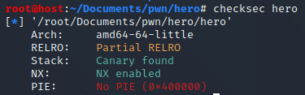
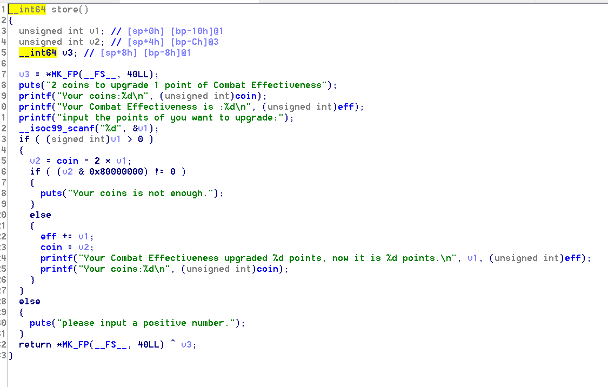
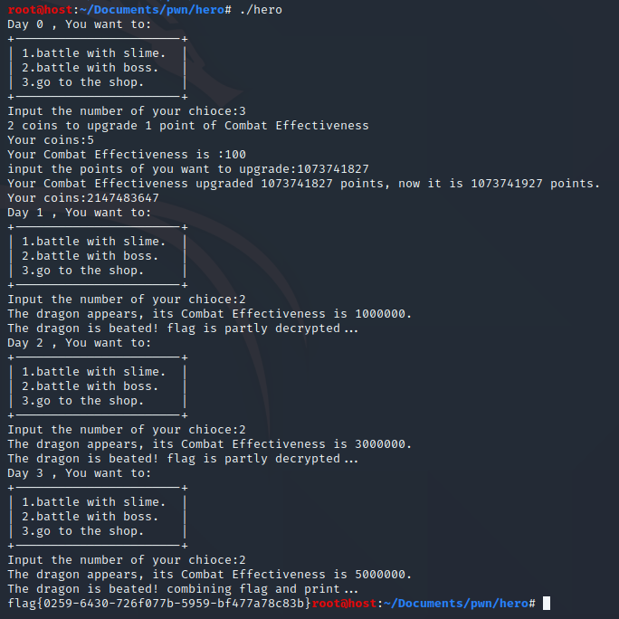

# hero

## 一、审题

这是一个与史莱姆和恶龙战斗的故事，请战胜三头恶龙，取得flag。张三长老说，试图patch这个程序的人会得到错误的flag…

## 二、解题思路

1、这道题本身属于RE，解题思路是在运行过程中patch攻击值就能得到flag，但是这个题还存在一个整数溢出的解法，考点在于有符号数的溢出，从负数溢出到正数，绕过验证条件，先用checksec看一下保护，64位，got表可写，栈溢出保护，堆栈不可执行，代码段加载地址固定；

2、使用ida打开程序，main函数里有两个函数，一个是outflag，顾名思义是用于输出flag的，还有一个dround函数，用于进行游戏，只有当bossexit为0才能进入outflag函数，进入dround函数，发现分别是打小怪、打boss、去商店，大小怪就是看攻击值是否大于一个随机数，打赢才得一个币，打赢boss能解密flag，有三个boss，要打三次，而且攻击值是固定的，再看去商店，发现可以买攻击值，这里存在一个整数溢出点，如下图，正常情况下选手只有5个币，而2个币才能买一点攻击值，但是这里购买的攻击值是可以选手输入的，而验证方法只是计算一下coin-2*攻击值，是否小于0，所以完全可以构造coin-2\*v1 < -2^31，使得其溢出为正数绕过验证，此时攻击值是一个超大数，完全碾压三只boss，解密flag，输出一气呵成；

3、因为coin为5，所以v1 > 2^30+2.5，故可以输入攻击值为1073741827 = 2^30+3，结果如下图所示。

